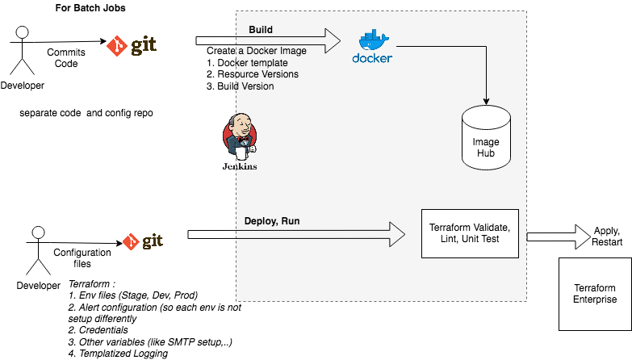
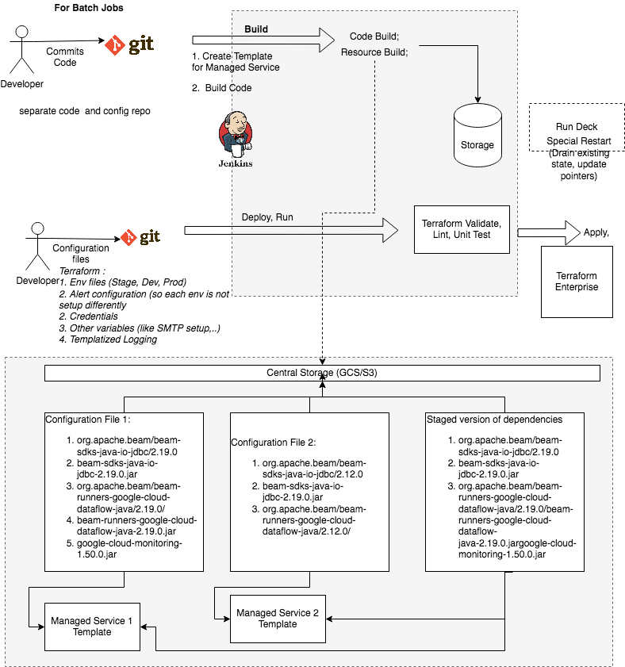

# Managing infrastructure as code
There has been much discussion around Infrastructure as Code (IAC); Adapting 12-factor App [12-factor](https://12factor.net/) or bringing basic ALM principles to write infrastructure code.  With cloud platforms adapting containerization and supporting its orchestration, it has enforced/automated much of the needs stated in the 12-factor.

Using the best of technologies around Terraform/Jenkins/Git/Cloud we streamlined our pipelines, but fell short in many places.  Here we want to highlight where we fell short and the workarounds.

We have two types of Deploys
Self-managed Apps that we containerize and manage deploy + run.
Apps that are running within a cloud managed services and are deployed within the constraints imposed by the managed service.

##Self-Managed Apps

Walking through the 12-factor considerations:
### Codebase : 
*One codebase tracked in revision control, many deploys*  : There is a one to one correspondence between Code base version (git) to Build Container version.  Container version is declared in a separate file in the code base.

### Dependencies : 
*Explicitly declare and isolate dependencies*  : Dependencies are managed in a Docker Template file.  All self-managed apps within the same project share this dependency.

### Config:  
*Store config in the environment* :  We use Terraform for orchestration.  Configuration variables are declared in the terraform files.   The configuration includes centrally adapted services such as:
Logging service
SMTP service
Backend Services (databases)

### Backing services : 
*Treat backing services as attached resources* : Configuration files in (3 above) state the values for these variables

### Build, release, run:  
*Strictly separate build and run stages* :  Terraform separates the configuration for orchestrating the different environments (dev, stage, prod,..)
Deploy stage attaches environment specific variables from terraform scripts to update the container.
The Version to be deployed is part of the terraform scripts
Terraform scripts are Validated and Tested before deploy

### Processes : 
*Execute the app as one or more stateless processes* :  Apps are stateless except the caching layer.  How do we bring statelessness to the caching layer?
Caching layer is a service by itself, Apps use REST calls to update and retrieve its content

### Port binding  
*Export services via port binding* :  Ports are part of Terraform configuration files.

### Concurrency: 
*Scale out via the process model* :  Once the process is containerized and stateless, concurrency is not a constraint any more.  If we are using K8 we can orchestrate the cluster deploys (green-blue deploys) and resource needs better.

### Disposability: 
*Maximize robustness with fast startup and graceful shutdown* :  With the above setup, the delay here is only imposed by the App’s needs.  If the app is strictly stateless then this is not constraint.

### Dev/prod parity
*Keep development, staging, and production as similar as possible* :

### Logs 
*Treat logs as event streams*

### Where we fell short

Configuration for core aspects (like Nexus usage) is part of the Docker Build.  Some configuration is hidden outside of Terraform scripts
How are we managing the same dependency but multiple versions floating around different services ?
Inconsistencies in format, naming, logging
Controlling unused variables or proliferation of config files
Apps running within a Managed Service

## Working with Managed Services

Walking through the 12-factor considerations.  What has changed here is (all else remains the same as the base case in self-managed containers):

### Dependencies : Explicitly declare and isolate dependencies  : When a managed services creates a container for you and all you are supplying is a Container configuration -  what are our constraints:
The dependent jars and version have to come from our storage (we cannot provide a link to an external source).  
As shown in the diagram above - we can drift in our library versions and it will be difficult to catch 

### Config:  Store config in the environment :  We use Terraform for orchestration.  Configuration variables are declared in the terraform files.   The configuration includes centrally adapted services such as the ones listed below.  
    *Logging service
    *SMTP service
    *Backend Services (databases)

If a single managed service is configured differently from one service to the next - there is much overlap and we may inadvertently break one when releasing the other.  Example:

There are two services that are using the same managed service.  Both the services provide authentication in their config.  Changing one service and not the other can lead to authentication failure - depending on how the managed service is consuming this change.

Build, release, run:  Strictly separate build and run stages :  Terraform separates the configuration for orchestrating the different environments (dev, stage, prod,..)

Is the managed service adhering to the environment separation?  We had instances where a Dev run caused resource constraints on Prod

### Disposability : Maximize robustness with fast startup and graceful shutdown : 
The managed service may not be ready for a restart and need an alternate procedure like - Drain and restart.  

## Where we fell short
Working within the constraints imposed by the managed service we are moving into a semi controlled process; the challenge came to us in :
Managing dependencies and dependency drifts within the services
When different services are running the same managed service, changes to one services might impact the other
Is the managed service adhering to how we are separating our environments?
Restarting of the managed service has to be controlled by our use case.  We cannot rely on the managed service to restart correctly per our requirements.

 

 

 

#

The Twelve Factor App is a Software as a Service (SaaS) design methodology created by Heroku. The idea is that in order to be really suited to SaaS and avoid problems with software erosion — where over time an application that’s not updated gets to be out of sync with the latest operating systems, security patches, and so on — an app should follow these 12 principles:

    Codebase One codebase tracked in revision control, many deploys
    Dependencies Explicitly declare and isolate dependencies
    Config Store config in the environment
    Backing services Treat backing services as attached resources
    Build, release, run  Strictly separate build and run stages
    Processes  Execute the app as one or more stateless processes
    Port binding  Export services via port binding
    Concurrency  Scale out via the process model
    Disposability  Maximize robustness with fast startup and graceful shutdown
    Dev/prod parity  Keep development, staging, and production as similar as possible
    Logs  Treat logs as event streams
    Admin processes Run admin/management tasks as one-off processes

 

 

